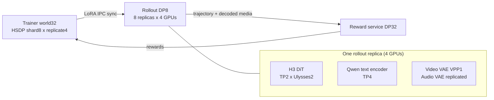

# MiniMax-H3 T2VA — 32-GPU hybrid-parallel deployment

MiniMax-H3 is a 33B dense omni-modal transformer that denoises video and stereo
audio jointly in one packed sequence. These recipes run it under vLLM-Omni
rollout with an FSDP trainer and a resident reward service on the same GPUs.

## Scope of what is verified

This directory documents a **deployment** that has passed capacity, LoRA-sync,
rollout/replay parity and throughput gates. It is not a converged RL recipe:

- Topology and the three-phase lifecycle are verified and reproducible.
- Rollout/replay log-prob parity holds at `~4e-5`, well inside the `1e-3` gate.
- **Reward convergence is still open.** No H3 recipe here has produced a
  sustained rise in held-out visual reward. A Wan2.1 trainside control on the
  same trainer, PickScore and GRPO path does rise (`0.6985 → 0.7201` over 20
  rollouts), which is what localizes the open problem to H3/reward rather than
  to the shared training stack.

Treat these files as infrastructure and as a correctness/performance baseline.

## Topology

Four nodes × 8 × 96GB GPUs. Three roles time-share the same 32 GPUs by
switching residency per phase, rather than statically partitioning them.



**Trainer** — `world_size=32`, FSDP `hybrid` (shard degree 8 inside a node,
replicated across the 4 nodes), FP32 master weights, BF16 mixed precision,
activation checkpointing on, LoRA on the attention Q/K/V/out and FFN of the 50
denoising blocks, `micro_batch_size=1`.

**Rollout** — 8 data-parallel replicas of 4 GPUs each; DiT TP2 × Ulysses2, text
encoder TP4, video VAE VPP1.

**Reward** — reward service DP32, long-lived process whose model residency
follows the phase switches.

**Phase order** — sync LoRA to the 8 replicas → rollout wakes and generates
video, audio and a sparse FP32 trajectory → rollout sleeps, reward scores →
trainer replays, backwards and steps → next rollout.

The switches that make this fit are `layout: colocate`,
`transport: colocate_store`, `enable_fsdp_offload: true`,
`offload_train_during_reward: true` and `rollout.config.enable_sleep_mode: true`.

## Measured throughput

Same K8 conditions: 8 prompts × 8 samples, 256×448×107, 24 transitions,
eta 0.6, PickScore-only.

| Rollout topology | median generate | peak memory | max parity drift |
| --- | --- | --- | --- |
| HSDP4 + UP4 | 112.697 s | 66,876 MiB | 3.73e-5 |
| TP2 × UP2 | 91.087 s | 77,436 MiB | 3.94e-5 |

TP2 × UP2 is 19.18% faster. K16 generate is ~182 s, roughly linear in sample
count. A TP4 arm raced a stale GPU keep-alive process and OOM'd, so that number
was discarded; TP2 × UP2 is therefore the fastest **verified** candidate, not a
proven global optimum.

## Recipes

```text
minimax_h3_t2va_vllmomni_32c_quality100_tp2_up2
  -> minimax_h3_t2va_vllmomni_32c_quality100
  -> minimax_h3_t2va_vllmomni_32c_8x8_hsdp8x4
  -> minimax_h3_t2va_vllmomni_32c_8x8
  -> minimax_h3_t2va_vllmomni_2x4_timeshare
  -> minimax_h3_t2va_trainside
```

`minimax_h3_t2va_trainside` is the in-process baseline; the `32c_*` layers add
the vLLM-Omni rollout, the 32-GPU geometry and the topology overrides.
`_tp4` and `_hsdp4` variants exist for topology comparison.

## Geometry constraint

H3 was released for a 768-pixel short edge with both axes a multiple of 32, and
`MiniMaxH3Geometry.resolve` enforces that by default. Lower-resolution runs must
opt in explicitly with `sampler_kwargs.allow_nonstandard_canvas: true`, which
still requires both axes to be multiples of 32 with a short edge ≥ 256 and an
area within the released bound. Anything outside the released distribution is an
unqualified setting — treat generated-quality regressions there as expected
until re-qualified.

## Known limitations

- **Rollout siblings are serial.** The adapter issues one request per sibling,
  so K8 → K16 roughly doubles generate time; request batching is not effective
  yet.
- **Decode is duplicated.** Under VPP1 every rank in a replica runs video then
  audio decode and only the output rank returns, instead of splitting the two
  decoders across ranks.
- **Trajectories travel through the driver.** Trajectory, reward media and
  reward rows are orchestrated through Ray and the driver rather than by
  rollout-worker to reward-worker GPU P2P.
- **Communication is not yet itemized.** TP all-reduce, Ulysses all-to-all, text
  TP4 broadcast, LoRA sync, VAE decode and sleep/wake have not been separated;
  that needs NVTX traces and per-rank timelines.
- **Reward DP32 is fine-grained.** At PickScore batch size 2 each rank does
  little work, so launch, scatter and on/offload overhead may dominate.
- **Trainer replay retains activations.** Sparse replay keeps several steps in
  one autograd graph even at micro-batch 1; step-wise backward and selective
  activation checkpointing are unexplored.

Deep performance work should wait until a fixed-eval reward rise is reproducible
on one H3 recipe — optimizing throughput before then just runs a wrong objective
faster.
