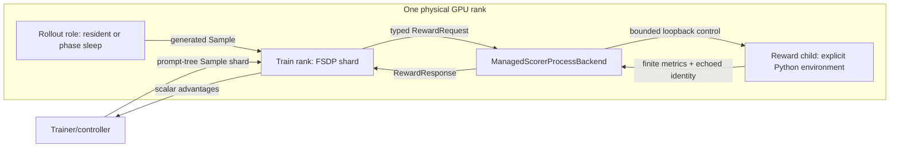
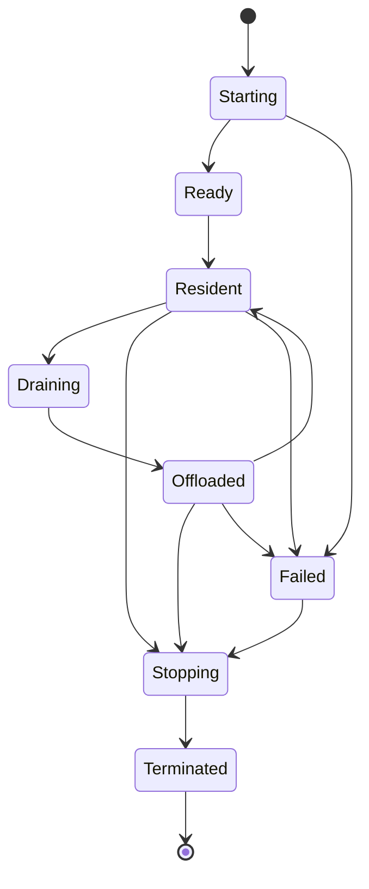

# Rank-Affine Reward Roles for Colocated RL

Status: initial design proposal
Scope: synchronous collocated RL, image and image-edit rewards first
Last researched: 2026-07-31

## Executive summary

UniRL currently supports two useful reward deployment shapes:

1. an in-process `LocalRewardBackend`, which is fast and naturally follows the
   train worker's GPU placement but must share its Python environment; and
2. `RemoteRewardBackend`, which isolates dependencies and can multiplex several
   reward models, but normally assumes an independently deployed HTTP service and
   independently reserved resources.

The BAGEL image-edit workload exposes a gap between them. The policy is trained
with FSDP8, rollout uses one vLLM-Omni BAGEL replica per card, and EditReward
requires a different Transformers environment. All eight train GPUs are already
reserved by Ray, yet the reward model is small enough relative to a 96 GiB H20 to
fit on those same cards. Reserving a separate reward box wastes GPUs; importing
EditReward into the train process is unsafe; sending every sample to rank 0 loses
DP parallelism.

This proposal makes reward inference a first-class, rank-affine role:

- each reward worker launches one persistent scorer child with an explicit Python
  executable;
- the child inherits exactly that worker's physical GPU;
- each worker scores only its local prompt-tree shard;
- train, rollout, and reward weights may remain simultaneously resident when the
  measured memory geometry permits it;
- control stays on a typed loopback protocol, while the media carrier can evolve
  independently;
- dedicated-pool and external-service modes remain supported for rewards that do
  not fit.

The initial implementation intentionally supports non-differentiable image and
image-edit scorers. Video, audio, text-only, latent, and differentiable reward
carriers are designed extension points, not claimed capabilities.

## Motivation: the BAGEL + EditReward case

The validated workload is:

- BAGEL-7B-MoT image editing;
- FSDP8 LoRA training;
- vLLM-Omni TP1/DP8 rollout;
- EditReward-MiMo-VL-7B, one scorer per GPU;
- eight prompts, eight samples per prompt, two optimizer updates;
- 512 x 512 images and fourteen denoising steps.

It has four coupled constraints.

### 1. The reward environment is incompatible with the train environment

The train and vLLM-Omni stack uses its own pinned Torch, Transformers, vLLM and
kernel set. EditReward is validated in a separate Python environment with
Transformers 4.57 and scorer-specific dependencies. A process can load only one
version of a Python package graph; virtual environments do not isolate imports
inside a single process.

### 2. Ray sees every train GPU as already reserved

A conventional reward actor requesting one logical GPU cannot be scheduled when
FSDP already owns all eight slots. Fractional resource declarations also do not
express the real requirement: the scorer must use the exact same physical GPU as
one train rank, not any GPU with a free fraction.

### 3. Centralized scoring destroys locality and parallelism

Gathering all generated images to rank 0 adds a hot spot, duplicates media
movement, serializes reward inference, and can exceed rank-0 host/GPU memory. The
natural partition already exists: `Sample` is DP-sharded by complete root-prompt
trees, and each shard can be scored independently.

### 4. The stricter collocated topology is still feasible

The measured H20 geometry leaves enough headroom to retain all three weight sets.
That makes phase offload optional rather than mandatory. The framework should
represent this choice explicitly instead of assuming every collocated model must
sleep between phases.

## Existing deployment modes

| Mode | Process / environment | GPU placement | Lifecycle | Strength | Limitation |
|---|---|---|---|---|---|
| Local in-process | Train/reward share one interpreter | Follows reward worker | Model object may stay loaded | Lowest call overhead | Dependency graph must be compatible |
| External HTTP | Independent service | External / user managed | Service owned externally | Strong isolation, cross-host | Extra GPUs are usually reserved; no rank affinity |
| Dedicated reward slab | UniRL/Ray-owned reward workers | Disjoint fraction of pool | Always resident or service-specific | Predictable capacity | Reduces policy/rollout GPU count |
| Phase time-multiplex | Separate process or local model | Same physical cards | Train/rollout/reward offload by phase | Fits large combinations | Transfer latency and host-memory pressure |
| Rank-affine resident | Explicit child environment | One child per reward DP rank | All role weights resident | No extra cards, no rank-0 gather | Requires measured HBM headroom |

These modes are complementary. A large HPSv3 or WISE deployment should use a
dedicated pool or external service; a small incompatible scorer should not need a
whole extra card merely to obtain environment isolation.

## Goals

1. Treat reward as a placement-aware role without changing
   `RewardService.score_and_attach(sample)`.
2. Preserve root-prompt-tree sharding from rollout through reward.
3. Allow a reward process to use an explicit Python executable and dependency
   environment.
4. Support rank-affine same-GPU placement without requesting another Ray GPU.
5. Make residency and phase offload explicit, validated lifecycle policies.
6. Bound request size, scorer batch size, and in-flight work independently.
7. Preserve finite, typed, per-sample reward and component-reward contracts.
8. Make retries idempotent and response ordering independent of completion order.
9. Keep the control protocol stable while allowing HTTP, shared-memory, object
   reference, or future device-local media carriers.
10. Keep legacy local and external HTTP recipes behaviorally unchanged by default.

## Non-goals

- General asynchronous/off-policy training in the first version.
- Token- or denoising-step-level reward streaming.
- Automatically deciding whether three models fit based on parameter count.
- Hiding a failed scorer by substituting zero reward.
- Carrying an autograd graph through HTTP or a process boundary.
- Supporting video, audio, text-only, and latent scorers before their carrier
  contracts are specified and tested.
- Replacing dedicated reward pools for models whose resident footprint is too
  large.

## Proposed architecture



### Logical components

**RewardService**

Remains the trainer-facing entry point. It projects the generated frontier Part
and its conditioning into a typed `RewardRequest`, calls one backend, validates
success flags, and attaches CPU `float32` reward tensors.

**ManagedScorerProcessBackend**

Owns child startup, health, placement validation, lifecycle RPCs, bounded
request chunking, retries, and shutdown. It implements the existing
`RewardBackend` interface and therefore does not leak transport concerns into a
trainer.

**Direct scorer server**

Owns exactly one scorer instance in the scorer environment. It serializes calls
unless the scorer declares safe concurrency, validates metric cardinality and
finiteness, and exposes optional lifecycle operations.

**Scorer**

Declares its input capability, model parameters, maximum model batch size,
concurrency, version, and lifecycle support. The initial capability is
`image`/`image_edit`.

### Proposed configuration shape

```yaml
reward:
  backend:
    _target_: unirl.reward.managed_process.ManagedScorerProcessBackend
    base_device: cpu
    config:
      _target_: unirl.reward.managed_process.ManagedScorerProcessSpec
      process:
        python_executable: /venvs/reward/bin/python
        service_root: /workspace/unirl-reward-service
        startup_timeout: 1200
        shutdown_timeout: 30
        log_dir: /tmp/unirl-reward
      scorer:
        name: editreward
        input_kind: image
        params:
          checkpoint_path: /models/EditReward
          model_name_or_path: /models/MiMo-VL-7B
          config_path: config/EditReward-MiMo-VL-7B-SFT-2508.yaml
          device: cuda
          dtype: bfloat16
      client:
        required_rewards: [editreward]
        request_batch_size: 8
        max_inflight: 1
        timeout: 600
        retries: 1
        aggregation_method: weighted_sum
```

The structure separates process ownership, scorer construction, and client
aggregation. It avoids copying every `RemoteRewardSpec` field into a generic
process spec.

## Placement and rank affinity

`RewardService.score_and_attach` uses `DP_SCATTER`; `Sample.slice` partitions by
whole root-prompt trees. Consequently:

- rollout and reward DP require the number of root prompts to be divisible by
  their DP size;
- generated samples per optimizer update must separately divide the train DP;
- `batch_size * samples_per_prompt` is not sufficient to validate rollout/reward
  scatter;
- a reward child must be attached to the reward worker that owns the shard, not
  selected from a global pool.

The managed process validates that the worker exposes exactly one intended GPU
unless an explicit oversubscription escape hatch is enabled. It passes an
explicit physical GPU/UUID to the child rather than trusting an arbitrary
multi-GPU `CUDA_VISIBLE_DEVICES` inherited from the parent.

No generated media is gathered through rank 0. DP-head results are concatenated
back into global prompt-tree order by the existing distributed dispatch layer.

## Data flow

### Before the scorer process

The distributed call carries a complete `Sample` shard so conditioning and
frontier rows remain aligned. `RewardService` then projects only reward-relevant
fields:

- conditioning text;
- optional conditioning/source image;
- generated image;
- root metadata;
- sample and group identity;
- policy and scorer versions.

Segments, diffusion trajectories, replay conditions, optimizer state, and model
weights never enter the scorer protocol.

### Image wire contract

Pure generation uses one image turn. Image editing uses two turns: source and
generated image. The initial carrier remains a versioned image protocol over
loopback HTTP because it is simple, observable, and already fast enough for the
measured workload.

Every item carries:

- protocol version;
- request ID;
- sample ID and group ID;
- source rank/shard;
- policy weight version;
- scorer name/version;
- prompt and JSON-safe metadata;
- one generated image and optional source image.

Responses echo identity and contain only finite scalar metrics or a typed error.
Correlation never relies solely on list position.

### What returns to training

Scorers return a small `{metric_name: float}` dictionary per sample. The client
reduces submetrics, aggregates reward models, and creates:

- `rewards: float32[N]`;
- `component_rewards: dict[str, float32[N]]`.

The trainer computes scalar advantages from `rewards`. Embeddings, hidden states,
decoded media, and scorer activations are not returned.

## Bounded batching and backpressure

Three distinct limits must not be conflated:

1. **DP shard size** — determined by prompts, fan-out, and DP topology.
2. **Transport request batch** — maximum items in one POST/RPC.
3. **Model microbatch** — maximum rows in one scorer forward.

The current remote path sends one whole DP shard in a single POST; the configured
backend `batch_size` does not chunk the request. This is safe only accidentally
when the shard has the same size. A 48-prompt, 16-sample, DP8 job produces 96
items per reward rank.

The proposed backend:

- chunks by `request_batch_size`;
- preserves and verifies item IDs while merging responses;
- exposes `max_inflight` and rejects unbounded submission;
- lets the scorer further split by model batch size;
- supports a bounded maximum wait for future cross-request microbatching;
- records queue, serialization, preprocessing, forward, and response times;
- drains accepted work before sleep/shutdown;
- retries one idempotent chunk, not an unversioned whole shard.

## Lifecycle

The process state machine is:



Lifecycle operations are explicit and idempotent:

- `health`: scorer identity, version, state, device, queue depth;
- `onload`: acquire model device state and become resident;
- `offload`: drain, move supported state to CPU, release allocator cache;
- `drain`: stop accepting requests and wait for in-flight scoring;
- `shutdown`: drain, close the scorer, and terminate cleanly.

Parent-death handling, process-group TERM/KILL fallback, and `atexit` are retained.
The trainer's default rollout behavior remains sleep-after-generate; all-resident
mode is opt-in and requires a measured memory budget.

## Correctness and failure invariants

1. Exactly one score or typed error is returned for every accepted item ID.
2. Every scalar is finite; NaN, infinity, null, booleans, and missing metrics fail
   the step.
3. A response must echo request, sample, policy, and scorer versions.
4. Retries use the same idempotency key and may not apply a result twice.
5. Request/response merge order is ID-based, never completion-order based.
6. The scorer cannot silently truncate a shard to its preferred batch size.
7. Required reward failure fails the complete on-policy step; optional rewards
   must define an explicit missing-value policy.
8. Reward inference is deterministic unless a scorer explicitly declares and
   logs stochastic sampling parameters and seed.
9. Media conversion is versioned and observable; JPEG, resize, FPS, frame
   selection, and normalization may not be implicit.
10. Offload/sleep cannot begin while an accepted request is in flight.
11. The child is bound to the expected physical device and may not escape Ray
   placement through an accidental multi-GPU visibility mask.
12. Legacy local and external HTTP backends retain their default semantics.

## Payload scope and future carriers

### Initial scope: image and image edit

Compressed images are a reasonable first HTTP payload. In the measured OpenGPT
corpus, source-image JPEG95/base64 had a median of about 410 KiB. The validated
BAGEL shard contained eight edits and produced a representative request of about
4.18 MB per rank, or about 34.17 MB globally across eight independent loopback
connections.

The initial managed backend therefore supports:

- prompt + generated image;
- instruction + source image + edited image;
- JSON-safe scorer metadata;
- multi-reward aggregation when all rewards consume the same image contract.

### Future: text

Text-only rewards are small and well suited to HTTP, but the current
`HistoryTurn` requires media. A future protocol adds explicit generated text,
reference/ground-truth, and metadata fields instead of fabricating media turns.

### Future: video

The carrier must be scorer-aware. VideoPickScore consumes one frame and should
not receive a full MP4; VideoCLIPDelta consumes selected source/generated frames;
VideoAlign genuinely consumes a clip. The protocol must support:

- selected frame lists;
- source and generated videos;
- full video by shared path, bytes, or shared-memory reference;
- original FPS, duration, dimensions, and codec metadata.

### Future: audio and T2AV

CLAP and ImageBind need waveform data and sample rate. The current remote schema
drops both. A future carrier supports PCM/shared-memory audio and synchronized
video/audio metadata.

### Future: latent and embedding rewards

Latent reward models should use a versioned tensor format such as safetensors or
an object/shared-memory reference, avoiding unnecessary VAE decode.

### Differentiable rewards

ReFL is a separate execution class. It returns a grad-carrying tensor and must
remain in a local/RPC-autograd path. It cannot be represented by this scalar
HTTP protocol.

## Empirical evidence

### Convergence run

- 8 x H20 96 GiB;
- 250/250 rollouts and 500 optimizer steps;
- fixed eval reward improved from `-0.7411` to `-0.2406`;
- final train reward `-0.2259`;
- no OOM or actor failure;
- final per-step breakdown: about 25.93 s generate, 4.40 s reward, 41.59 s train.

[W&B run](https://wandb.ai/dingzuhao7-tencent/bagel-it2i-pr88-repro/runs/qm69ere0)

### Post-upstream-merge validation

- code path validated after the Sample/Part upstream merge;
- fixed eval plus three complete rollouts;
- exit code 0;
- last step 69.79 s;
- reward DP8 3.57 s;
- peak HBM 88,174–88,696 MiB/card;
- eight reward children each served five successful requests;
- EditReward load-time device delta approximately 16 GiB.

[W&B run](https://wandb.ai/dingzuhao7-tencent/bagel-it2i-pr88-repro/runs/epnzra9g)

These results prove one BAGEL/EditReward/H20 geometry. They do not prove that an
arbitrary policy, rollout engine, reward model, batch size, or accelerator can
remain resident.

## Comparison with other frameworks

Research snapshots are commit-pinned because these systems are evolving quickly.

### VIME

[VIME at `1fc199d`](https://github.com/vllm-project/vime/commit/1fc199d9d57eb9d9e66d337cce406c27e7bd916f)
has strong Ray placement for Megatron and vLLM, colocated/disjoint rollout,
sleep/wake, multi-model serving, external engines, and several weight-transfer
planes. Reward is normally a callback inside a zero-GPU CPU RolloutManager or one
user-managed URL. A frozen vLLM judge can be added as a named rollout model, but
custom code must route requests. It has no first-class arbitrary reward process,
rank affinity, separate reward interpreter, or reward lifecycle.

Lesson: borrow its explicit server-group topology, bounded generation concurrency,
transport separation, and weight-sync validation; do not centralize custom reward
execution before DP placement.

### verl

[verl at `aebd1f8`](https://github.com/verl-project/verl/commit/aebd1f8a27d5606226f2b85682cacaf2fdf7eaa7)
implements an experimental Reward Loop with CPU reward workers, a
RewardModelManager, GPU inference replicas, and a router.

Its terminology is important:

- **Colocate Mode** (`enable_resource_pool=false`) shares the global GPU pool.
  Rollout completes, rollout servers sleep, reward servers wake and score, then
  reward sleeps. This is temporal colocation.
- **Standalone Mode** (`enable_resource_pool=true`) allocates a separate reward
  GPU pool. Reward weights remain resident and sample-level scoring can overlap
  rollout.

Standalone Mode is **not** the design proposed here. It spends additional reward
GPUs and routes samples through distributed reward workers and a central
least-inflight HTTP router. Rank-affine managed children share each train GPU,
route rank N to child N, and use an explicit reward environment.

verl does provide useful patterns: controller-side chunking across reward workers,
replica TP/DP/PP sizing, dedicated versus shared resource pools, and a router
abstraction.

### VeRL-Omni

[VeRL-Omni at `d8e83ab`](https://github.com/verl-project/verl-omni/commit/d8e83ab12ba8c84d6c3039a611f6b77a4fd55d7d)
extends verl for multimodal generation. Released capabilities include vLLM GenRM,
sample-level async reward on a dedicated pool, multi-reward aggregation, external
JPEG/pickle HTTP scoring, and custom HPSv3/PickScore functions.

Its validated async reward recipe uses verl **Standalone Mode**: actor GPUs plus
an additional reward GPU. This reduces wall time through overlap but may reduce
total accelerator efficiency. Colocated reward uses sleep/wake rather than
simultaneous three-role residency.

Current limitations relevant to UniRL:

- arbitrary custom GPU scorers are not first-class placed/lifecycle-managed
  reward models;
- local HPSv3 uses a process-global singleton in a reward worker with no GPU
  reservation or sleep/wake;
- the generic HTTP scorer sends one JPEG sample per request via pickle;
- multi-reward subfunctions run sequentially per sample;
- video/audio semantics are not represented by the generic image client;
- first-class custom reward placement remains an open design topic.

VeRL-Omni's newer latent scorer is a useful reference for versioned safetensors,
retries, fail-fast behavior, and avoiding VAE decode.

### OpenRLHF

[OpenRLHF at `bc71bb1`](https://github.com/OpenRLHF/OpenRLHF/commit/bc71bb19464aca306b33080b2d2bb45d154e2f49)
offers dedicated reward GPU groups, reward/critic colocation, or full
`colocate_all`. Its synchronous Hybrid Engine uses vLLM sleep/wake to time-share
memory; asynchronous training keeps generation resources separate. Remote/custom
reward functions use async Python or HTTP after sequence completion.

Lesson: expose placement modes explicitly and keep full colocation an opt-in
synchronous schedule.

### NeMo RL

[NeMo RL at `d152853`](https://github.com/NVIDIA-NeMo/RL/commit/d152853a91fc5e1e1f66fc06e3a7e5ff5fb6ef7e)
models reward as a dedicated `RewardModelEnvironment` with its own
`RayVirtualCluster`. This is clean ownership and isolation, but no reward-model
colocation mode was found.

Lesson: a reward provider should own a clear resource/lifecycle boundary even
when the concrete placement is rank-affine rather than dedicated.

### AReaL

[AReaL at `6c0f952`](https://github.com/areal-project/AReaL/commit/6c0f9521e1f01d66864665644f83f9e2015ce327)
uses process-pool wrappers for blocking custom rewards and has a strong external
online HTTP/session transport with backpressure and staleness control. Its
documented allocations do not include a first-class GPU reward role.

Lesson: carry trajectory/policy version, use bounded queues and explicit
backpressure, and separate external session ownership from model placement.

## Why this design is distinct

Other frameworks cover three common points well:

1. temporal colocation through sleep/wake;
2. dedicated reward pools for asynchronous overlap;
3. user-managed external reward endpoints.

The validated UniRL point is different:

- same physical GPU;
- separate process and Python environment;
- deterministic one-child-per-rank routing;
- no additional Ray GPU reservation;
- all train, rollout, and reward weights resident simultaneously;
- local DP shard scored without central gathering.

This mode is valuable when the reward model is small enough to fit but
dependency-incompatible with the train process. It should complement, not replace,
the established modes.

## Rollout plan

1. Land the default-compatible diffusion rollout residency lifecycle and correct
   root-prompt DP preflight.
2. Land a generic managed image scorer with bounded transport, identity, lifecycle,
   placement validation, and contract tests.
3. Land BAGEL it2i as the first end-to-end consumer.
4. Profile HPSv2, ImageReward, CLAP and PickScore-family footprints before adding
   new resident recipes.
5. Add scorer-aware video/audio/text carriers only after their semantics and
   memory behavior are measured.
6. Consider sample-level reward overlap only after policy-version and on-policy
   barriers are explicit.

## Open questions

- Should managed children be represented as a new placement mode or remain a
  RewardBackend implementation?
- Which physical-device identity is authoritative across Ray, CUDA UUIDs, MIG,
  and containers?
- Should multi-reward image panels share one media decode process or run separate
  managed children?
- Which lifecycle operations are mandatory for a scorer to claim collocated
  support?
- What request-size threshold selects inline bytes versus shared-memory media?
- How should optional rewards affect group-level validity and advantage
  normalization?
- Which IDs and model digests are required for reproducibility across resume?

## References

- [VIME](https://github.com/vllm-project/vime/commit/1fc199d9d57eb9d9e66d337cce406c27e7bd916f)
- [verl Reward Loop design](https://verl.readthedocs.io/en/latest/advance/reward_loop.html)
- [verl source snapshot](https://github.com/verl-project/verl/commit/aebd1f8a27d5606226f2b85682cacaf2fdf7eaa7)
- [VeRL-Omni](https://github.com/verl-project/verl-omni/commit/d8e83ab12ba8c84d6c3039a611f6b77a4fd55d7d)
- [VeRL-Omni async reward](https://verl-omni.readthedocs.io/en/latest/algo/async_reward.html)
- [OpenRLHF Hybrid Engine](https://openrlhf.readthedocs.io/en/latest/hybrid_engine.html)
- [NeMo RL environments](https://docs.nvidia.com/nemo/rl/latest/guides/environments.html)
- [AReaL workflow guidance](https://areal-project.github.io/AReaL/en/best_practices/workflow.html)
- [UniRL reward overview](README.md)
